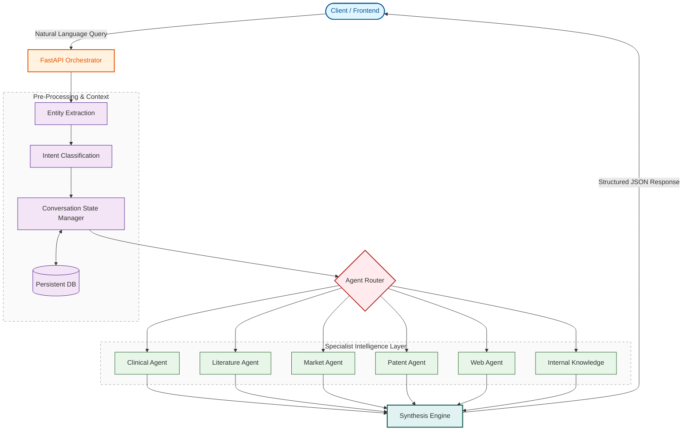

# NovusAI

**NovusAI** is an agent-orchestrated biomedical intelligence platform designed to perform structured analysis across **clinical evidence, scientific literature, market data, patents, web intelligence, and internal knowledge**.  
The system emphasizes **deterministic orchestration, conversation memory, and reproducible synthesis**, with optional large-model reasoning powered by **Groq-hosted LLMs**.

This repository represents a **fully working prototype** focused on architectural clarity, correctness, and explainability rather than production hardening.

---

## Core Capabilities

- **Multi-agent orchestration** with clean separation of concerns
- **Conversation-aware analysis**
  - Persistent state
  - Replayable conversations
  - Deterministic follow-ups
- **Literature-first biomedical reasoning**
- **PDF ingestion and analysis**
- **Structured synthesis (not free-form chat)**
- **Visualization-ready outputs**
- **LLM augmentation only where it adds value**

---

## Agents Overview

NovusAI uses a **modular agent architecture**, where each agent operates independently and reports structured outputs to the synthesis layer.

### Implemented Agents

- **Clinical Agent**
  - Mechanism of action
  - Clinical trial signals
  - Safety and efficacy summaries

- **Literature Agent**
  - Scientific paper analysis
  - PDF ingestion and parsing
  - Evidence-backed reasoning (abstracts, findings, conclusions)

- **Market Agent**
  - Drug-only, condition-only, and drug–condition market views
  - Deterministic data sourcing via curated mock datasets

- **Patent Agent**
  - Drug–condition intellectual property signals
  - Early-stage innovation indicators

- **Web Intelligence Agent**
  - Public discourse and external signals
  - Lightweight aggregation logic

- **Internal Knowledge Agent**
  - Private datasets
  - Organization-specific insights

---

## Architecture Overview



## Project Setup
```text
NovusAI/
├── backend/
│   └── app/
│       ├── agents/             # Domain-specific AI logic (Clinical, Patent, Market, etc.)
│       ├── api/                # FastAPI routes & endpoint definitions
│       ├── auth/               # JWT authentication & user permission logic
│       ├── db/                 # Database connection & session management
│       ├── llm/                # LLM provider integrations (Groq, etc.)
│       ├── models/             # SQLAlchemy/Pydantic data models
│       ├── mockdata/           # JSON datasets for testing (Patent & Market mocks)
│       ├── pre_synthesis/      # Query interpretation & synonym expansion
│       └── services/           # External API clients (PubMed, iCite, Patent Service)
├── frontend/
│   ├── src/
│   │   ├── api/                # Axios/Fetch clients for backend communication
│   │   ├── auth/               # AuthContext & Protected Route logic
│   │   ├── components/         # Reusable UI (Visualization, Panels, Navbar)
│   │   ├── pages/              # Main views (Chat, Scan, Admin, Profile)
│   │   └── assets/             # Static images and icons
│   ├── tailwind.config.js      # Styling configuration
│   └── vite.config.ts          # Build tool configuration
└── .gitignore                  # Environment and dependency exclusions
```

---

## Conversation State & Memory

One of the core strengths of NovusAI is **explicit conversation state management**.

### Features

- Each interaction is stored with:
  - Extracted entities
  - Intent
  - Agent outputs
  - Final synthesis
- Conversations can be:
  - Replayed cleanly
  - Continued deterministically
  - Debugged agent-by-agent
- State is persisted in a database to avoid hallucinated continuity

This enables:
- Follow-up questions without re-extraction
- Reliable comparisons
- Clean audit trails for analysis

---

## LLM Strategy (Groq)

### Important Design Decision

- **Local Ollama LLM has been removed**
- **Groq-hosted models are used for heavier reasoning**

### Why Groq?

- Significantly lower latency
- Better handling of long biomedical contexts
- More reliable for synthesis and literature reasoning

LLMs are used **selectively**, primarily for:
- Complex synthesis
- Literature interpretation
- Natural language structuring
- Entity and Intent Extraction

Rule-based logic and deterministic pipelines are preferred wherever possible.

---

## PDF & Literature Handling

- PDFs are ingested directly by conversation history and synthesis agent
- Output include user query and synthesis agent answer along with chart etc.

---

## Visualizations

- Agent outputs are structured to support:
  - Charts
  - Tables
  - Comparative views
- Visualization logic is kept separate from reasoning
- Enables clean frontend or notebook rendering

---

## Tech Stack

### Backend
- Python 3.10+
- FastAPI
- Pydantic
- httpx
- Conda-managed environment
- Groq API (LLM)
- Hugging Face models (entity extraction / intent classification)

### Frontend
- React
- MantineUI

---

## Environment Setup (Conda)

### Create Environment

```bash
conda create -n novusai python=3.10
conda activate novusai
```

### Generate/Install Dependencies

```bash
pip freeze > requirements.txt
pip install -r requirements.txt
```

### Frontend

```bash
npm install
```
## How to Run ?

### Backend

```bash
uvicorn app.main:app --reload
```

### Frontend

```bash
npm run dev
```

## Screenshots 

## Author
Devashish Mishra
B.Tech | AI & Systems Engineering
Project: NovusAI

### Keys are hardcoded in each agents code replace them with your keys before running
## Keys Required

- Groq Key
- EPO OPS Key

### Thank You 
