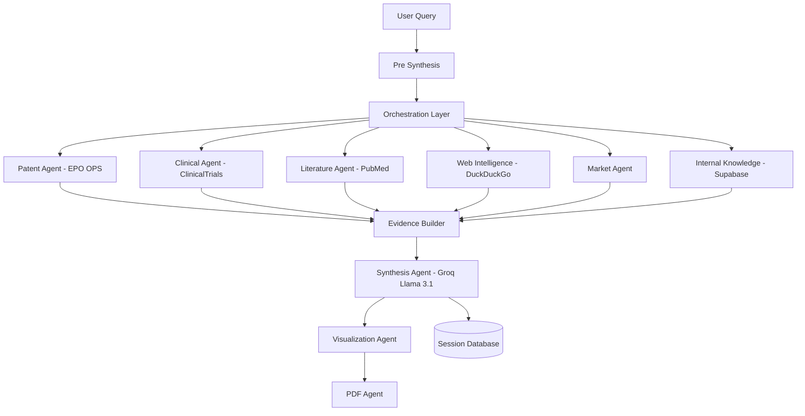

# NovusAI – Advanced Agentic RAG for Drug Repurposing

NovusAI is an **advanced Agentic RAG (Retrieval-Augmented Generation)** system for drug repurposing and biomedical intelligence.  
It orchestrates multiple specialized agents to retrieve evidence from heterogeneous biomedical sources, synthesize insights using a large language model, and generate structured answers with visual analytics.

The system supports private document ingestion, persistent sessions, and automated report generation.

---

## Live Deployment

- **Frontend (Netlify):** [Live Link](https://novusai.netlify.app/)
- **Backend (Render):** https://novusai-backend.onrender.com

---

## High-Level Flow (Agentic RAG)


```mermaid
flowchart TB
    U[User Query]
    PS[Pre Synthesis]
    ORCH[Orchestration Layer]

    PAT[Patent Agent - EPO OPS]
    CLIN[Clinical Agent - ClinicalTrials]
    LIT[Literature Agent - PubMed]
    WEB[Web Intelligence - DuckDuckGo]
    MKT[Market Agent]
    INT[Internal Knowledge - Supabase]

    EVID[Evidence Builder]
    SYN[Synthesis Agent - Groq Llama 3.1]
    VIS[Visualization Agent]
    PDF[PDF Agent]
    DB[(Session Database)]

    U --> PS --> ORCH

    ORCH --> PAT
    ORCH --> CLIN
    ORCH --> LIT
    ORCH --> WEB
    ORCH --> MKT
    ORCH --> INT

    PAT --> EVID
    CLIN --> EVID
    LIT --> EVID
    WEB --> EVID
    MKT --> EVID
    INT --> EVID

    EVID --> SYN
    SYN --> VIS
    VIS --> PDF
    SYN --> DB
```

---

## Agentic RAG Pipeline
**1. Pre-Synthesis**
- Extracts disease and drug from user query
- Builds synonym sets using:
- https://www.ebi.ac.uk/ols4/api
**2. Orchestration**
- Dispatches enriched query to all agents in parallel
**3. Retrieval (Agents)**
- Patent Agent -> EPO OPS
- Clinical Agent -> clinicaltrials.gov
- Literature Agent -> PubMed
- Web Intelligence Agent -> DuckDuckGo
- Market Agent	-> Mock market data
- Internal Knowledge Agent	-> Supabase Storage
**4. Evidence Builder**
- Normalizes and merges multi-source evidence
**5. Synthesis (LLM)**
- Uses Groq API
- Model: llama-3.3-70b-versatile
**6. Visualization**
- Generates plot-ready data for:
- Market trends
- Treated vs untreated patients
- Clinical study phases
**7. Persistence**
- Stores synthesized answers
- Enables session continuity

---

## Private Knowledge Vault (Admin Only)
- File types: .pdf, .txt
- Storage: Supabase (company_docs bucket)
- Used by Internal Knowledge Agent

---

## Authentication
- JWT-based
Roles:
- admin → upload documents
- employee → query only

---

## Tech Stack
### Backend
- FastAPI
- SQLAlchemy
- JWT
- Supabase Storage
- Groq API

### Frontend
- React + Vite
- Mantine UI
- Axios
- ReCharts

### Deployment
- Backend → Render
- Frontend → Netlify

---

## Local Setup
### Backend
```bash
cd backend
pip install -r requirements.txt
uvicorn app.main:app --reload
```

### Frontend
```bash
cd frontend
npm install
npm run dev
```

---

## Environment Variables (Backend)
```bash
SUPABASE_URL=xxxxxxxxxx
SUPABASE_SERVICE_KEY=xxxxxxxxxx
SUPABASE_ANON_KEY=xxxxxxxxxx
JWT_SECRET_KEY=xxxxxxxxxx
JWT_ALGORITHM=xxxxxxxxxx
ENV=xxxxxxxxxx
PUBLIC_API_URL=xxxxxxxxxx
GROQ_API_KEY=xxxxxxxxxx
GROQ_BASE_URL=xxxxxxxxxx
MODEL_NAME=xxxxxxxxxx
CONSUMER_KEY=xxxxxxxxxx
CONSUMER_SECRET=xxxxxxxxxx
```

## Environment Variables (Frontend)
```bash
VITE_API_BASE_URL=https://<backend-url>
```

---

## Repository Structure
```bash
NovusAI/
  backend/
  frontend/
```

---

## Author
Devashish Mishra
B.Tech | AI/ML | Full-Stack | Cloud
