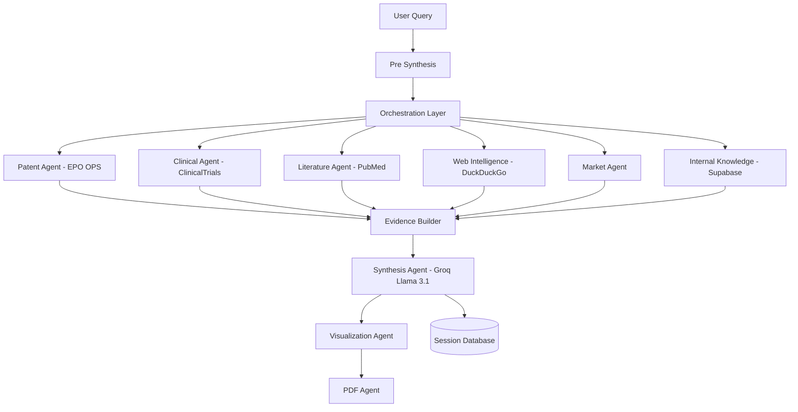

# NovusAI – Advanced Agentic RAG for Drug Repurposing

NovusAI is an **advanced Agentic RAG (Retrieval-Augmented Generation)** system for drug repurposing and biomedical intelligence.  
It orchestrates multiple specialized agents to retrieve evidence from heterogeneous biomedical sources, synthesize insights using a large language model, and generate structured answers with visual analytics.

The system supports private document ingestion, persistent sessions, and automated report generation.

## Live Deployment

- **Frontend (Netlify):** [Live Link](https://novusai.netlify.app/)
- **Backend (Render):** https://novusai-backend.onrender.com

## Screenshot


## High-Level Flow (Agentic RAG)


```mermaid
flowchart TB
    U[User Query]
    PS[Pre Synthesis]
    ORCH[Orchestration Layer]

    PAT[Patent Agent - EPO OPS]
    CLIN[Clinical Agent - ClinicalTrials]
    LIT[Literature Agent - PubMed]
    WEB[Web Intelligence - DuckDuckGo]
    MKT[Market Agent]
    INT[Internal Knowledge - Supabase]

    EVID[Evidence Builder]
    SYN[Synthesis Agent - Groq Llama 3.1]
    VIS[Visualization Agent]
    PDF[PDF Agent]
    DB[(Session Database)]

    U --> PS --> ORCH

    ORCH --> PAT
    ORCH --> CLIN
    ORCH --> LIT
    ORCH --> WEB
    ORCH --> MKT
    ORCH --> INT

    PAT --> EVID
    CLIN --> EVID
    LIT --> EVID
    WEB --> EVID
    MKT --> EVID
    INT --> EVID

    EVID --> SYN
    SYN --> VIS
    VIS --> PDF
    SYN --> DB
```

## Agentic RAG Pipeline
## 1. Pre-Synthesis Layer
The entry point focuses on linguistic precision and query expansion.
* **Entity Extraction:** Automatically isolates **Disease** and **Drug** entities from natural language queries.
* **Synonym Expansion:** Connects to the [EBI OLS4 API](https://www.ebi.ac.uk/ols4/api) to build comprehensive synonym sets, ensuring the search covers all scientific and trade names.

## 2. Orchestration & Retrieval
A parallelized agentic layer that queries diverse data silos simultaneously.

| Agent | Source | Data Domain |
| :--- | :--- | :--- |
| **Patent Agent** | **EPO OPS** | Intellectual property, chemical filings, and legal status. |
| **Clinical Agent** | **ClinicalTrials.gov** | Study phases, recruitment status, and primary endpoints. |
| **Literature Agent** | **PubMed** | Academic journals and peer-reviewed clinical research. |
| **Web Intel Agent** | **DuckDuckGo** | Real-time news, press releases, and market alerts. |
| **Market Agent** | **Mock Data** | Commercial trends, pricing, and competitive landscape. |
| **Internal Agent** | **Supabase** | Proprietary documents and historical knowledge. |

## 3. Data Processing & Synthesis
Transforming raw, heterogeneous data into structured intelligence.

### Evidence Builder
* **Normalization:** Standardizes units, dates, and nomenclature across all 6 agents.
* **Merging:** Deduplicates information and ranks evidence based on source credibility.

### LLM Synthesis
* **Engine:** Groq API
* **Model:** `llama-3.3-70b-versatile`
* **Output:** Generates high-fidelity summaries with inline citations.

## 4. Analytics & Visualization
The system prepares JSON-ready objects for front-end rendering:
* **Market Trends:** Historical and projected growth curves.
* **Patient Outcomes:** Comparative bar charts (Treated vs. Untreated).
* **Clinical Roadmap:** Pie charts or timelines showing Study Phases (I, II, III, IV).

## 5. Persistence & Continuity
* **Storage:** Saves synthesized answers to a permanent database.
* **Session State:** Enables "rebuild" functionality where the model remembers previous context for iterative discovery.

## Private Knowledge Vault (Admin Only)
- File types: .pdf, .txt
- Storage: Supabase (company_docs bucket)
- Used by Internal Knowledge Agent

## Authentication
- JWT-based
Roles:
- admin → upload documents
- employee → query only

## Tech Stack
### Backend
- FastAPI
- SQLAlchemy
- JWT
- Supabase Storage
- Groq API

### Frontend
- React + Vite
- Mantine UI
- Axios
- ReCharts

### Deployment
- Backend → Render
- Frontend → Netlify

## Local Setup
### Backend
```bash
cd backend
pip install -r requirements.txt
uvicorn app.main:app --reload
```

### Frontend
```bash
cd frontend
npm install
npm run dev
```

## Environment Variables (Backend)
```bash
SUPABASE_URL=xxxxxxxxxx
SUPABASE_SERVICE_KEY=xxxxxxxxxx
SUPABASE_ANON_KEY=xxxxxxxxxx
JWT_SECRET_KEY=xxxxxxxxxx
JWT_ALGORITHM=xxxxxxxxxx
ENV=xxxxxxxxxx
PUBLIC_API_URL=xxxxxxxxxx
GROQ_API_KEY=xxxxxxxxxx
GROQ_BASE_URL=xxxxxxxxxx
MODEL_NAME=xxxxxxxxxx
CONSUMER_KEY=xxxxxxxxxx
CONSUMER_SECRET=xxxxxxxxxx
```

## Environment Variables (Frontend)
```bash
VITE_API_BASE_URL=https://<backend-url>
```

## Repository Structure
```bash
NovusAI/
  backend/
  frontend/
```

## Author
Devashish Mishra
B.Tech | AI/ML | Full-Stack | Cloud
